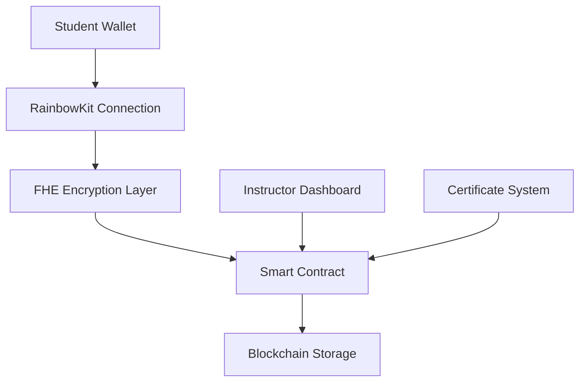

# 🎓 FHESafe Exams
### *Revolutionary Blockchain-Powered Academic Assessment Platform*

[](https://opensource.org/licenses/MIT)
[](https://reactjs.org/)
[](https://www.typescriptlang.org/)
[](https://ethereum.org/)

---

## 🌟 **What Makes FHESafe Exams Special?**

FHESafe Exams represents a **paradigm shift** in academic assessment technology. By combining cutting-edge **Fully Homomorphic Encryption (FHE)** with **blockchain infrastructure**, we've created the world's first truly privacy-preserving examination platform that maintains complete academic integrity.

### 🔥 **Core Innovation**
- **Zero-Knowledge Exam Taking**: Students' answers remain encrypted throughout the entire process
- **Blockchain Immutability**: Every exam record is permanently stored and verifiable
- **Real-Time Privacy**: Answers are encrypted as students type, not after submission
- **Academic Transparency**: Institutions can verify results without compromising student privacy

---

## 🛠️ **Technology Architecture**



### **Frontend Stack**
- ⚛️ **React 18** with TypeScript for type-safe development
- 🎨 **shadcn/ui** + **Tailwind CSS** for modern, accessible UI
- ⚡ **Vite** for lightning-fast development and builds
- 🔗 **RainbowKit** + **Wagmi** for seamless Web3 integration

### **Blockchain Infrastructure**
- 🔐 **Zama FHEVM** for homomorphic encryption operations
- ⛓️ **Ethereum Sepolia** testnet for secure, cost-effective testing
- 📜 **Solidity** smart contracts with FHE support
- 🔑 **Web3 Wallet** authentication (MetaMask, WalletConnect, etc.)

---

## 🚀 **Quick Start Guide**

### **Prerequisites**
- Node.js 18+ and npm
- MetaMask or compatible Web3 wallet
- Sepolia ETH for gas fees

### **Installation**

```bash
# Clone the repository
git clone https://github.com/datawhaleAI/fhesafe-exams.git
cd fhesafe-exams

# Install dependencies
npm install

# Configure environment
cp .env.example .env
# Edit .env with your configuration

# Start development server
npm run dev
```

### **Environment Configuration**

Create a `.env` file with the following variables:

```env
# Blockchain Configuration
NEXT_PUBLIC_CHAIN_ID=11155111
NEXT_PUBLIC_RPC_URL=https://sepolia.infura.io/v3/YOUR_INFURA_API_KEY

# Wallet Connect
NEXT_PUBLIC_WALLET_CONNECT_PROJECT_ID=YOUR_WALLET_CONNECT_PROJECT_ID

# Contract Address
NEXT_PUBLIC_CONTRACT_ADDRESS=YOUR_DEPLOYED_CONTRACT_ADDRESS
```

---

## 📚 **User Journey**

### **For Students** 🎓
1. **Connect** your Web3 wallet to establish identity
2. **Navigate** to the dashboard to view available exams
3. **Start** an exam with real-time FHE encryption
4. **Submit** encrypted answers to the blockchain
5. **Track** your progress and view certificates

### **For Instructors** 👨‍🏫
1. **Create** new examinations with custom parameters
2. **Monitor** student submissions in real-time
3. **Grade** encrypted answers using FHE operations
4. **Issue** blockchain-verified certificates
5. **Maintain** academic integrity through transparent records

---

## 🔒 **Security & Privacy Features**

| Feature | Description | Benefit |
|---------|-------------|---------|
| **FHE Encryption** | Answers encrypted during computation | Complete privacy preservation |
| **Blockchain Storage** | Immutable exam records | Tamper-proof academic integrity |
| **Wallet Authentication** | Web3 identity verification | Secure, decentralized access |
| **Zero-Knowledge Proofs** | Verifiable without revealing data | Privacy + transparency |
| **Smart Contract Logic** | Automated exam management | Trustless, transparent operations |

---

## 🌐 **Supported Networks & Wallets**

### **Blockchain Networks**
- ✅ **Ethereum Sepolia** (Primary testnet)
- 🔄 **Ethereum Mainnet** (Coming soon)
- 🔄 **Polygon** (Planned)

### **Wallet Support**
- 🦊 **MetaMask** (Primary)
- 🔗 **WalletConnect** (Universal)
- 🏦 **Coinbase Wallet**
- 🌈 **Rainbow Wallet**
- 📱 **Mobile Wallets** (via WalletConnect)

---

## 🚀 **Deployment Options**

### **Vercel (Recommended)**
```bash
# Deploy to Vercel
vercel --prod

# Configure environment variables in Vercel dashboard
# Set all variables from your .env file
```

### **Manual Deployment**
```bash
# Build for production
npm run build

# Preview locally
npm run preview

# Deploy to your preferred hosting service
```

### **Smart Contract Deployment**
```bash
# Install Hardhat
npm install --save-dev hardhat @nomicfoundation/hardhat-toolbox

# Deploy to Sepolia
npx hardhat run scripts/deploy.js --network sepolia
```

---

## 📊 **Project Structure**

```
fhesafe-exams/
├── 📁 src/
│   ├── 📁 components/          # Reusable UI components
│   ├── 📁 pages/              # Application pages
│   ├── 📁 hooks/              # Custom React hooks
│   ├── 📁 lib/                # Utility libraries
│   └── 📁 assets/             # Static assets
├── 📁 contracts/              # Solidity smart contracts
├── 📁 public/                 # Public assets
├── 📄 .env.example           # Environment template
├── 📄 package.json           # Dependencies
└── 📄 README.md              # This file
```

---

## 🤝 **Contributing**

We welcome contributions! Here's how you can help:

1. **Fork** the repository
2. **Create** a feature branch: `git checkout -b feature/amazing-feature`
3. **Commit** your changes: `git commit -m 'Add amazing feature'`
4. **Push** to the branch: `git push origin feature/amazing-feature`
5. **Open** a Pull Request

### **Development Guidelines**
- Follow TypeScript best practices
- Write comprehensive tests
- Update documentation
- Ensure accessibility compliance

---

## 📄 **License & Legal**

This project is licensed under the **MIT License** - see the [LICENSE](LICENSE) file for details.

### **Important Disclaimers**
- ⚠️ This is a **demonstration project** for educational purposes
- 🔒 Always use **testnet** for development and testing
- 💰 Ensure you have sufficient **Sepolia ETH** for gas fees
- 🔐 Keep your **private keys secure** and never commit them to version control

---

## 🆘 **Support & Resources**

### **Getting Help**
- 📖 **Documentation**: [FHESafe Exams Docs](https://docs.fhesafe-exams.com)
- 🐛 **Issues**: [GitHub Issues](https://github.com/datawhaleAI/fhesafe-exams/issues)
- 💬 **Discussions**: [GitHub Discussions](https://github.com/datawhaleAI/fhesafe-exams/discussions)

### **External Resources**
- 🔗 **FHEVM Documentation**: [Zama FHEVM Docs](https://docs.zama.ai/fhevm)
- 🌐 **Ethereum Sepolia**: [Sepolia Faucet](https://sepoliafaucet.com/)
- 🦊 **MetaMask**: [MetaMask Download](https://metamask.io/)

---

## 🏆 **Acknowledgments**

Built with ❤️ by the **DataWhale AI** team, pushing the boundaries of what's possible in educational technology.

**Special thanks to:**
- Zama team for FHEVM technology
- Rainbow team for wallet integration
- The open-source community for inspiration

---

<div align="center">

**🌟 Star this repository if you find it helpful! 🌟**

[⬆ Back to Top](#-fhesafe-exams)

</div>